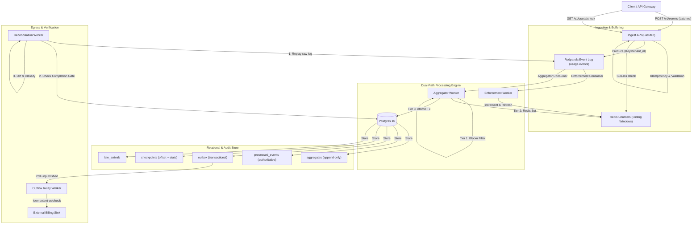
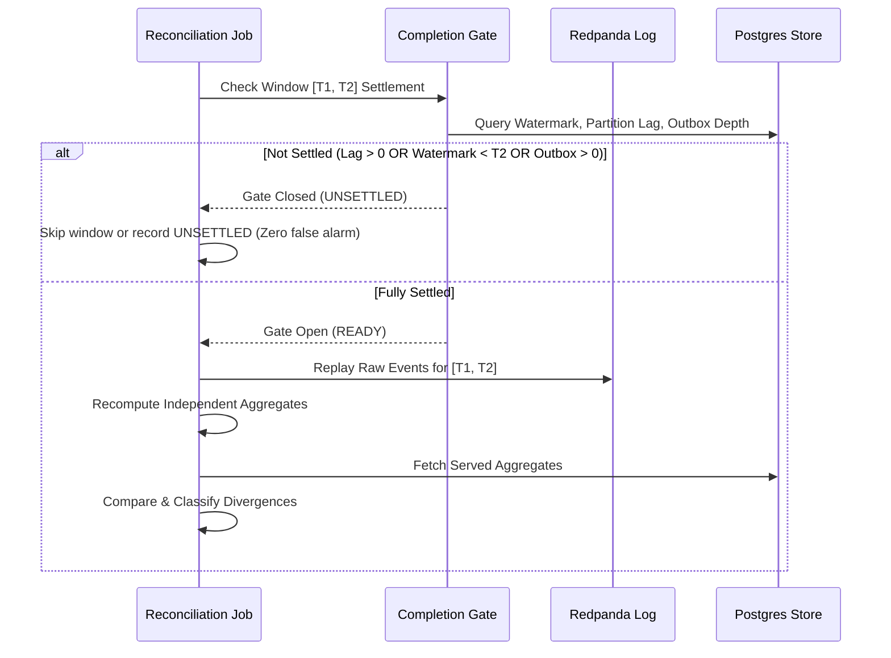

# Tally — Architecture & Design Specification

---

## 1. System Topology



---

## 2. Ports and Adapters (Hexagonal Layering)

To preserve code testability, determinism, and longevity, the system is strictly decoupled using Hexagonal Architecture:

```
src/tally/
├── domain/       Pure domain models, state machines, ports (no I/O, no network, no clock)
├── adapters/     Concrete implementations of domain ports (Redpanda, Postgres, Redis, HTTP)
├── app/          Use-case orchestrators (IngestPipeline, AggregationEngine, ReconcileJob)
├── api/          FastAPI controllers, request validation, HTTP status mappings
├── workers/      Continuous asyncio loop processes (AggregatorWorker, OutboxRelayWorker)
├── cli/          Typer command-line interface for local workflows and benchmarks
└── config/       Pydantic Settings composition root (the ONLY component reading environment variables)
```

Layering rules enforced mechanically in CI via `import-linter`:
$$\text{cli} \longrightarrow \text{api} \longrightarrow \text{workers} \longrightarrow \text{config} \longrightarrow \text{app} \longrightarrow \text{adapters} \longrightarrow \text{domain}$$

---

## 3. Data Pipeline & Lifecycle

### 3.1 Event Ingestion
1. **Wire Validation**: Each incoming `UsageEvent` is validated for required client UUID (`event_id`), `tenant_id`, metric name, and Decimal `quantity`.
2. **Dual Timestamping**: The client provides `occurred_at` (event time in UTC). The server assigns `received_at` (system processing time in UTC).
3. **Backpressure & Load Shedding**:
   - If in-flight produce queue < high watermark (e.g., 10,000): Process normally.
   - If queue exceeds high watermark: Return `429 Too Many Requests` with `Retry-After: 1`.
   - If queue exceeds critical shedding threshold: Shed `low_priority` events first (e.g., informational telemetry), increment the shed counter metric, and accept only billable tier events.

### 3.2 Partitioning & Ordering
- Redpanda partitions are keyed by `tenant_id`.
- All events for a given tenant land on the same partition in sequential order.
- **Hot Tenant Strategy**: Configured high-volume tenants (identified via configuration or dynamic traffic detection) route to sub-partition keys (`tenant_id:bucket`) or a dedicated high-throughput topic (`usage.events.hot`) to prevent noisy neighbors from blocking standard tenant partitions.

### 3.3 Three-Tier Deduplication
1. **Tier 1 (In-Memory Counting Bloom Filter)**: Zero I/O, sub-microsecond evaluation. If the Bloom filter says "not seen", the event definitely has not been seen. False positive rate calibrated to 1% at 1,000,000 keys.
2. **Tier 2 (Redis Set with TTL)**: Sub-millisecond network lookup against recent event keys within a sliding window (e.g., 24 hours).
3. **Tier 3 (Postgres `processed_events` Primary Key)**: Authoritative durability guarantee. If a duplicate slips past Tiers 1 and 2, the `INSERT INTO processed_events` fails on unique constraint.

### 3.4 Event-Time Windowing & Watermarking
- **Window Assignment**: Events are assigned to tumbling time windows based strictly on `occurred_at`.
- **Watermark Definition**:
  $$\text{Watermark}(p) = \max_{e \in p}(\text{occurred\_at}(e)) - \text{allowed\_lateness}$$
- **Window Sealing**: When the partition watermark passes `window_end`, the window is marked `SEALED`.
- **Late Arrival Handling**: If an event arrives with `occurred_at < window_end` after the window has sealed:
  1. The event is recorded in the `late_arrivals` audit table with measured lateness in milliseconds.
  2. Rather than mutating the sealed aggregate, a **correction row** is inserted into `aggregates` with `revision = prior_revision + 1`.

### 3.5 Atomic Checkpointing
- Kafka auto-commit is **explicitly disabled**.
- During window processing, partition offsets and accumulated aggregate values are written in the **exact same Postgres transaction**:
  ```python
  async with db.transaction():
      await store.save_aggregates(aggregates)
      await store.insert_outbox_messages(outbox_events)
      await store.save_checkpoint(consumer_id, partition, offset, state)
  ```
- On worker crash and restart, the worker queries `checkpoints`, issues a seek to the exact stored offset, and recovers in-flight state without duplicate processing or missing data.

### 3.6 Transactional Outbox & Billing Sink
- An outbox record is inserted alongside the aggregate.
- An independent `OutboxRelay` worker polls unpublished rows (`published_at IS NULL`) with `SELECT ... FOR UPDATE SKIP LOCKED`.
- The relay delivers the payload to the billing sink with exponential backoff.
- The billing sink is idempotent on `aggregate_key`.
- Upon reaching max retry attempts (e.g., 5), rows are flagged as dead-lettered for manual investigation.

---

## 4. Reconciliation with the Completion Gate

The central differentiator of Tally is its ability to mathematically prove that the exact path is correct without producing false divergence alarms.



### Divergence Classification Matrix
- **`MATCH`**: Recomputed quantity $=$ Served quantity exactly. The expected outcome.
- **`REAL`**: Recomputed quantity $\neq$ Served quantity, unexplained by known late events. Severity: High / Bug.
- **`UNSETTLED`**: Window evaluated before pipelines drained. Excluded by the completion gate. The specific condition that failed -- watermark still inside the grace buffer, non-zero consumer lag, or undrained outbox -- is recorded in the record's evidence rather than in a separate class, because no caller acts differently on the three.
- **`LATE_ARRIVAL`**: Variance matches the sum of audited `late_arrivals` for that window. Informational.

`MATCH` is distinct from `REAL` with a zero difference: agreement is the common
case, and it must be readable from the class alone. The UI colours the badge
from the class and never from the magnitude of the difference, so a
misclassification shows up rather than being masked.
